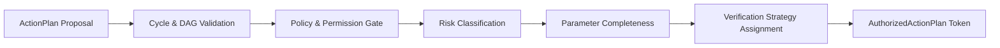

# Action Authorization Architecture

## 1. Overview
The `ActionAuthorizationEngine` separates the responsibility of **Understanding** from **Acting**.
- Intent Parsers: **UNDERSTAND** and **PROPOSE**.
- ActionAuthorizationEngine: **VALIDATES** and **AUTHORIZES**.
- SideEffectBarrier: **EXECUTES** and **VERIFIES**.

No tool, parser, skill, or agent may execute a physical side-effect without obtaining an `AuthorizedActionPlan` from this engine.

## 2. Authorization Pipeline

## 3. Security & Policy Tiers
Policies govern which actions can proceed autonomously:
1. `auto` (Default for general tasks):
   - `LOW` & `MEDIUM` risk actions proceed autonomously.
   - `HIGH` actions proceed with auditing.
   - `CRITICAL` actions (system power, disk wipe, format) require confirmation if configured.
2. `confirm_destructive`:
   - All destructive actions (`shutdown`, `restart`, `format`, `delete database`) require user confirmation.
3. `confirm_all`:
   - Every external mutation requires interactive confirmation.
4. `deny`:
   - All external execution is blocked.

## 4. Risk Classification Matrix
| Risk Level | Operations | Authorization Policy |
| :--- | :--- | :--- |
| `LOW` | System diagnostics, read queries, status checks | Approved autonomously across all active policies |
| `MEDIUM` | Browser launch, app launch, process read | Approved under `auto` and `plan` policies |
| `HIGH` | File modifications, downloads, code execution, package installs | Audited; confirmation under `confirm_all` |
| `CRITICAL` | Poweroff, restart, disk format, DB drop, registry edit | Confirmation required under `confirm_destructive` |

## 5. Dependency DAG Integrity
The authorization engine performs cycle detection on the proposed DAG. Plans containing circular references (`A -> B -> A`) or references to missing action IDs are immediately denied with descriptive error explanations.
