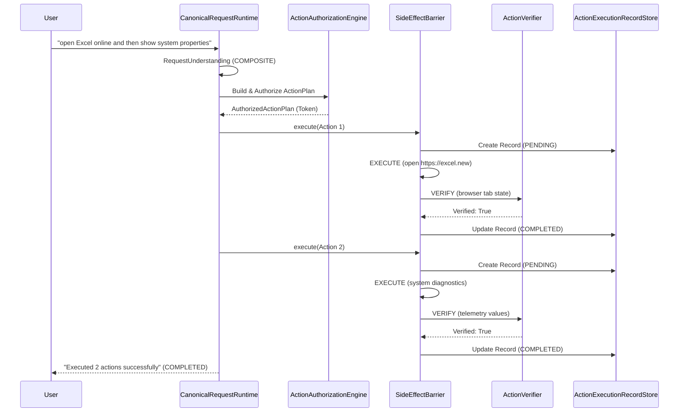

# Execution Runtime & Side-Effect Barrier Architecture

## 1. Overview
The `CanonicalRequestRuntime` and `SideEffectBarrier` form the hardened execution foundation of BR JARVIS.
All interface surfaces (CLI, Web, Voice, Desktop, Orchestrator, AgentLoop, Background tasks) converge on `CanonicalRequestRuntime.handle()`.

## 2. Transactional Execution Lifecycle
Every physical side-effect follows the mandatory transaction invariant:
$$\text{RECORD} \rightarrow \text{AUTHORIZE} \rightarrow \text{EXECUTE} \rightarrow \text{OBSERVE} \rightarrow \text{VERIFY} \rightarrow \text{RECORD}$$

## 3. Truthful Execution State Machine
BR JARVIS never reports false completion. The user-facing states reflect actual system verification:
- `UNDERSTANDING`: Processing and classifying request.
- `PLANNING`: Constructing multi-step ActionPlan DAG.
- `WAITING_FOR_APPROVAL`: Paused for clarification or user confirmation.
- `EXECUTING`: Dispatched to SideEffectBarrier.
- `VERIFYING`: Evaluating physical outcome against post-conditions.
- `RECOVERING`: Attempting automated runtime repair.
- `COMPLETED`: All actions executed and verified.
- `PARTIAL`: One or more actions succeeded, but subsequent actions failed or were skipped.
- `FAILED`: Primary action failed.
- `CANCELLED`: Interrupted by user request.

## 4. Partial Execution Guarantees
If Step 1 succeeds and Step 2 fails:
- The task is reported as `PARTIAL`.
- The user is informed: `"Partial task execution: Completed 1 of 2 steps. Step 1: Success. Step 2: FAILED — [error detail]"`.
- BR JARVIS never says `"Done"` before physical verification passes.
