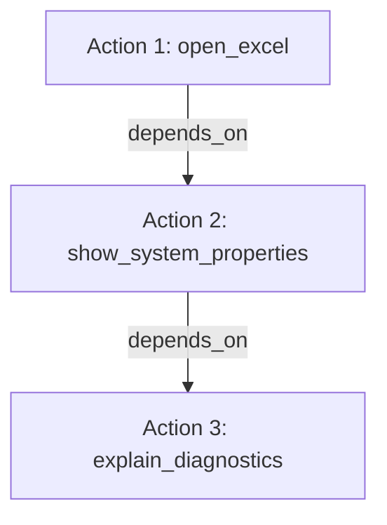

# Intent Arbitration & Action Decomposition Architecture

## 1. Overview
The Intent Arbitration subsystem parses the output of `RequestUnderstandingEngine` and arbitrates between competing interpretations:
- **Semantic Grouping vs Multi-Action Decomposition**
- **Sequential vs Parallel vs Conditional DAG Ordering**
- **Action Proposing vs Action Authorizing**

## 2. Semantic Grouping vs Independent Actions
Not every conjunction (`and`) signifies multiple independent operations. The intent engine employs context-aware semantic grouping:

### Grouped Single Actions:
- Diagnostic Telemetry: `"show CPU and RAM usage"` -> Grouped into a single `system_diagnostics` action querying psutil.
- Browser Navigation: `"open chrome and github"` -> Grouped into a single browser launch opening `https://github.com`.

### Multi-Action Composite Requests:
- Multi-App Launches: `"open Chrome and then open Notepad"` -> Two distinct `launch_app` actions.
- Action + Diagnostic: `"open Excel and show system properties"` -> Action 1: launch Excel, Action 2: system diagnostic.
- File Workflows: `"download report and move it to Documents"` -> Action 1: download, Action 2: file move (dependent on Action 1).

## 3. Directed Acyclic Graph (DAG) Representation
Complex requests are modeled as an `ActionPlan` DAG:

### Dependency Rules:
1. If Action $N$ depends on Action $N-1$:
   - Action $N-1$ must execute and pass physical verification before Action $N$ is dispatched.
2. If Action $N-1$ fails or verification does not pass:
   - Action $N$ is marked `SKIPPED`.
   - The overall execution state is truthful: `PARTIAL` (not `COMPLETED`).

## 4. Ordering Signals
The following temporal sequencing markers establish explicit edge dependencies in the ActionPlan DAG:
`first`, `then`, `and then`, `after that`, `after this`, `next`, `finally`, `followed by`, `after`, `before`, `once`.

## 5. Conditional Branching
When conditional language is detected (`if`, `unless`, `only if`, `otherwise`, `or else`, `when failed`):
- Actions are flagged with `is_conditional = True`.
- Fallbacks are maintained in the DAG.
- If primary action fails, the fallback action is evaluated.
