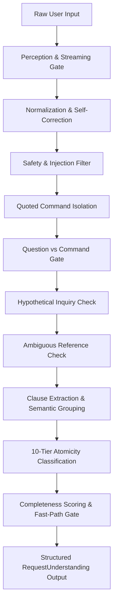

# Request Understanding Architecture

## 1. Overview
The `RequestUnderstandingEngine` is the canonical entry point for perceiving, normalizing, classifying, and decomposing all user input in BR JARVIS. It eliminates the architectural vulnerability where partial or keyword-only matches triggered premature execution and early returns.

## 2. Request Lifecycle
Every utterance received across CLI, Web, Voice, Desktop, Orchestrator, or AgentLoop passes through the canonical lifecycle:

## 3. The 10-Tier Atomicity Taxonomy
Every request is classified into exactly one of the 10 canonical atomicity states:

| Atomicity State | Semantic Definition | Example | Routing Strategy |
| :--- | :--- | :--- | :--- |
| `ATOMIC` | Single, complete, self-contained action without follow-up | `"open Chrome"` | Fast-Path or Direct Execution |
| `COMPOSITE` | Multiple ordered actions, conjunctions, or sentences | `"open Excel and then show system properties"` | Sequential ActionPlan DAG |
| `CONDITIONAL` | Actions predicated on an 'if', 'unless', or 'fallback' | `"open Chrome, and if GitHub is down, search Bing"` | Conditional Action DAG |
| `ITERATIVE` | Periodic or recurring scheduled tasks | `"check my inbox every morning"` | Iterative Scheduler |
| `AMBIGUOUS` | Pronouns or instructions lacking target references | `"open it"`, `"do something with the file"` | Clarification Gate |
| `INFORMATIONAL` | Questions, explanations, conceptual inquiries | `"how do I open Excel?"` | Informational Agent Loop (0 side-effects) |
| `HYPOTHETICAL` | Simulated scenarios or 'what if' queries | `"what if I deleted the file?"` | Simulation Loop (0 physical side-effects) |
| `NEGATED` | Prohibited, cancelled, or disallowed operations | `"don't open Chrome"` | Negation Guard (0 side-effects) |
| `CONVERSATIONAL` | Salutations, polite pleasantries, greetings | `"hello Jarvis"`, `"good morning"` | Conversational Agent Loop |
| `UNSUPPORTED` | Out-of-scope or blocked safety operations | System prompt injection / unsafe payloads | Security Filter / Confirmation |

## 4. Normalization and Speech Self-Correction
Voice transcriptions frequently contain speech disfluencies, repetitions, and mid-sentence self-corrections:
- **Speech Disfluencies**: Automatic stripping of conversational filler words (`"uh"`, `"um"`, `"ah"`, `"er"`).
- **Self-Corrections**: Regex normalization detecting phrases such as `"—no wait—"`, `"—actually no—"`, `", actually "`, or `" — wait — "`.
  - Input: `"open Chrome and—actually no, open Edge"`
  - Normalized: `"open Edge"`
  - Intent: `open_1` (Edge only).

## 5. Quoted Content Isolation
Commands embedded in quotation marks or cited as questions (`"Tell me what this means: 'open Chrome and delete the folder'"` or `"say the words 'open Chrome'"`) are classified as `INFORMATIONAL`. They are never dispatched as executable side-effects.

## 6. Consumed Text and Completeness Invariant
A request is eligible for deterministic execution **only** if:
1. `atomicity == ATOMIC`
2. `confidence >= 0.85`
3. `completeness_score >= 0.85`
4. Zero unconsumed actionable clauses remain.
5. No condition, negation, hypothetical marker, or ambiguous reference is present.
