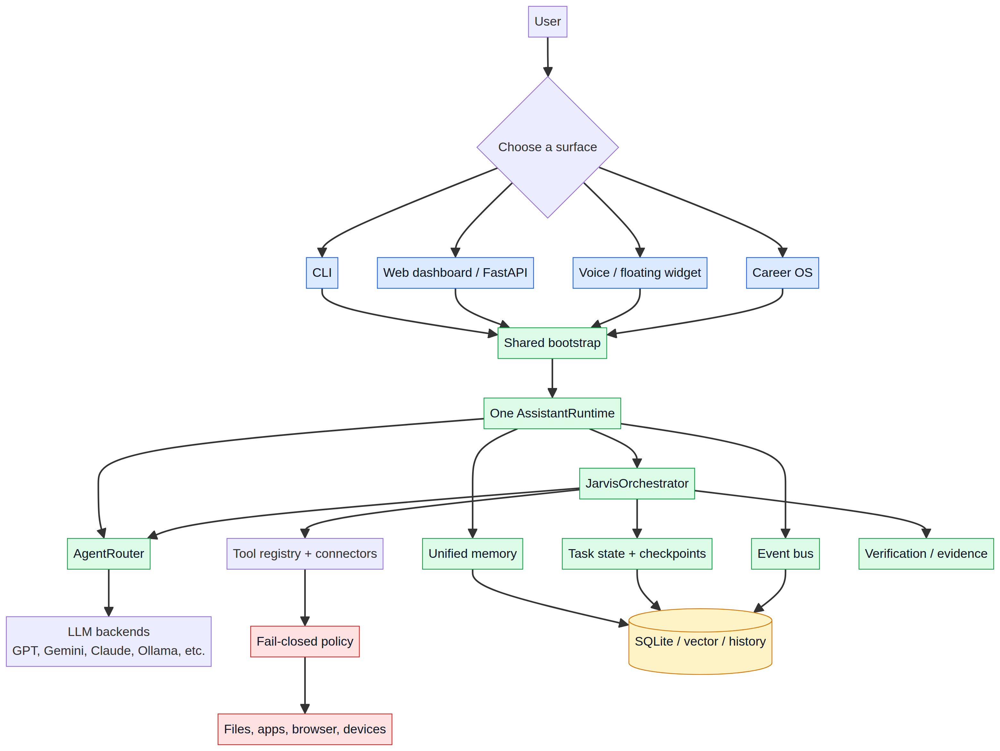
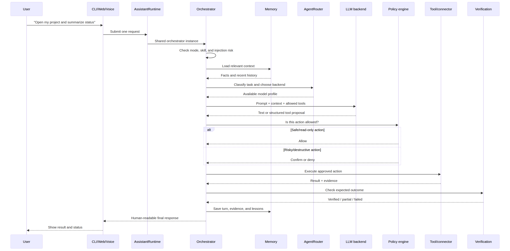
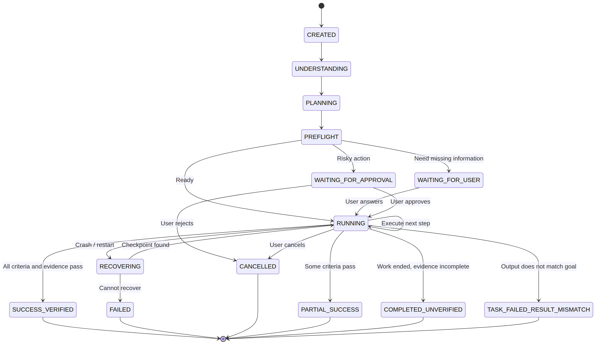
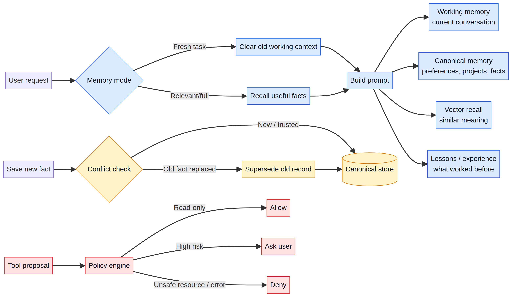

# BRJARVIS: Beginner-Friendly Project and Interview Preparation Book

**Prepared by Manus AI**  
**Purpose:** Understand the project from zero, explain it clearly in an interview, and answer common architecture questions with confidence.

> **One-sentence definition:** BRJARVIS is a local-first, multimodal AI assistant platform that accepts requests through CLI, web, voice, desktop, and Career OS surfaces, then uses one shared Python runtime to route models, call tools, remember context, verify results, and protect risky actions.

---

## How to Use This Book

Read Chapters 1–5 first if you are completely new. They explain the project’s purpose, architecture, request flow, memory, and security in simple words. Read Chapters 6–9 before the interview because they explain the code structure, trade-offs, testing evidence, and a complete example. Chapter 10 is a revision sheet of likely interview questions.

The examples are intentionally simple. When the book says “the assistant opens an application” or “the assistant reads a file,” the codebase may use several internal modules, but the important interview idea is the same: **the model proposes work, policy decides whether it is allowed, a tool performs it, and verification checks the result.**

---

# Chapter 1 — What Problem Does BRJARVIS Solve?

Imagine having one assistant that can understand a text request, listen to your voice, read a screen, search the web, inspect files, control applications, remember useful facts, and manage a job-application workflow. BRJARVIS is designed to provide that experience while keeping the main runtime on the user’s own machine.

The project is broader than a normal chatbot. A normal chatbot mainly performs this cycle:

```text
User question → Language model → Text answer
```

BRJARVIS aims for a safer and more useful cycle:

```text
User request → Understand → Plan → Choose a model → Propose tools
→ Check permissions → Execute → Verify evidence → Save state → Respond
```

The project’s README describes the main product as a **local-first, multimodal AI operating environment** for task execution, software work, system automation, voice interaction, personal memory, connectors, and Career OS workflows [1]. “Local-first” means the application is designed to run primarily on the user’s computer, although it can call cloud or local model providers depending on configuration.

## The easiest analogy

Think of BRJARVIS as a small operating system for an AI assistant.

| Operating-system idea | BRJARVIS equivalent | Simple meaning |
|---|---|---|
| Screen or terminal | CLI, web dashboard, voice UI, floating widget | Where the user talks to the assistant |
| Kernel or control centre | `AssistantRuntime` and `JarvisOrchestrator` | The shared brain and coordinator |
| Drivers | Model backends and connectors | Bridges to external systems |
| File system | Workspace, artifacts, SQLite, memory stores | Where state and outputs are saved |
| Process manager | Task state, queue, workflow engine | Tracks work while it is running |
| Security boundary | Guardian, policy engine, path policy | Decides what the assistant may do |
| Logs and telemetry | Event bus, history, audit records | Explains what happened |

The most important design principle is that **the presentation surfaces are adapters**. The CLI, web UI, voice UI, and Career OS should not each create their own independent assistant. They should all call the same shared runtime [1].

---

# Chapter 2 — The 90-Second Interview Explanation

If an interviewer asks, “Tell me about your project,” a good beginner-friendly answer is:

> “BRJARVIS is a Python-based local-first AI assistant platform. It supports multiple entry points such as a CLI, FastAPI web dashboard, voice interface, floating widget, and a Career OS module. All of these surfaces use one shared `AssistantRuntime`, which creates the model router, orchestrator, memory, event bus, and tool registry. For each request, the orchestrator recalls relevant context, selects an available model using the router, interprets a response that may contain a tool call, checks the security policy, executes the approved tool, verifies the result, stores evidence, and returns a clean answer. Tasks are represented as persistent state, so the system can pause for approval, recover from a restart, and distinguish verified success from an unverified or partial result. The main engineering challenges are coordinating many subsystems, controlling tool execution safely, managing memory, and keeping historical compatibility code from competing with the maintained runtime.”

This answer works because it covers the project’s **purpose, architecture, request lifecycle, persistence, security, and trade-offs** without claiming that the language model itself is the whole system.

## Three ideas to remember

First, **one runtime** prevents split state. The user can start with the CLI and later open the web dashboard without creating a completely different assistant instance.

Second, **the model is not automatically authorized**. A model can suggest `file_write` or `run_code`, but the policy engine still evaluates the action.

Third, **completion requires evidence**. A sentence from the model saying “done” is not enough. The system records tool results and checks whether the expected outcome was actually reached.

---

# Chapter 3 — Architecture from the Top Down

## 3.1 The complete beginner diagram



The editable Mermaid source is available at [`diagrams/system-overview.mmd`](diagrams/system-overview.mmd).

The flow is easiest to understand from top to bottom.

| Layer | What it does | Important locations |
|---|---|---|
| Presentation | Accepts input and displays output | `src/brjarvis/apps`, `src/brjarvis/web`, `src/brjarvis/desktop`, `start.py` |
| Bootstrap and lifecycle | Creates the shared runtime and manages startup/shutdown | `src/brjarvis/core/bootstrap.py`, `src/brjarvis/core/runtime.py` |
| Orchestration | Coordinates understanding, memory, model calls, tools, and responses | `src/brjarvis/orchestrator/core.py` |
| Routing | Chooses an available AI backend | `src/brjarvis/router`, `src/brjarvis/integrations/backends` |
| Tools and connectors | Performs real actions such as reading files or calling services | `src/brjarvis/tools`, `src/brjarvis/actions`, `src/brjarvis/connectors` |
| Security | Applies permissions, risk checks, and path rules | `src/brjarvis/security`, `src/brjarvis/guardian` |
| Task state | Persists goals, steps, approvals, checkpoints, and evidence | `src/brjarvis/agent/task_state.py` |
| Memory and history | Stores working context, durable facts, conversations, lessons, and audit records | `src/brjarvis/memory`, `src/brjarvis/history` |
| Events and diagnostics | Broadcasts lifecycle events and exposes health information | `src/brjarvis/events`, `src/brjarvis/diagnostics` |

## 3.2 The composition root

The composition root is the place where the application assembles its major objects. In this project, `build_assistant_runtime()` in `src/brjarvis/core/bootstrap.py` is the key function.

It performs the following work:

1. It obtains the core runtime and event bus.
2. It loads available model backends.
3. It creates an `AgentRouter`.
4. It creates a `JarvisOrchestrator`.
5. It registers shared objects in the dependency-injection container.
6. It installs a shutdown hook.
7. It publishes a startup event.
8. It returns one `AssistantRuntime` object.

The function uses a lock and double-checked singleton logic. In simple words, if the CLI, web server, and voice thread all start near the same time, they should receive the same shared runtime rather than accidentally creating three independent stacks [2].

### Interview phrase

> “The composition root is important because it centralizes object creation and lifecycle ownership. It prevents the presentation layer from constructing its own model clients, memories, or event buses.”

## 3.3 Why the launcher matters

`start.py` is a source-checkout dispatcher. It supports commands such as `status`, `doctor`, `web`, `cli`, `floating`, `voice`, `career`, `smoke`, `audio`, `test`, and `version` [3]. The installed package also defines command-line entry points in `pyproject.toml`, including `jarvis`, `jarvis-cli`, and `jarvis-server` [4].

A useful mental model is:

```text
start.py or installed command
        ↓
choose a surface
        ↓
call the maintained application bootstrap
        ↓
use the shared AssistantRuntime
```

The repository also contains compatibility launchers and historical subsystems. In an interview, explain that the maintained direction is the `src/brjarvis` package and the shared runtime, while root-level launchers and older modules may exist for backward compatibility [1].

---

# Chapter 4 — What Happens When a User Sends a Request?

## 4.1 Request lifecycle diagram



The editable Mermaid source is available at [`diagrams/request-flow.mmd`](diagrams/request-flow.mmd).

Use this example request:

> “Read the project status and summarize the important problems.”

The internal story is approximately as follows.

### Step 1: A surface receives the request

The request can arrive from the CLI, a FastAPI endpoint, a voice interface, or another surface. The surface should translate its input into the common runtime call rather than implementing a separate reasoning system.

### Step 2: The orchestrator checks the request

`JarvisOrchestrator.chat()` checks for prompt-injection risk, special modes such as `/mode coder`, skills, and quick deterministic actions. If a high-risk prompt-injection pattern is detected, the guardian can block the request before model execution [5].

### Step 3: The system chooses a memory mode

The task-memory router decides whether the new request is fresh, should load relevant memory, or should use a broader context. This matters because blindly attaching every old conversation to every new request wastes tokens and can contaminate a new task with irrelevant information.

### Step 4: Relevant context is recalled

The orchestrator can recall facts, prior conversation, project information, or learned lessons. The request is then added to working memory, and a user turn is recorded in history.

### Step 5: The router selects a backend

The router classifies the task using keywords and routing rules. For example, coding may prefer GPT, Claude, DeepSeek, or Ollama, while a local-private request should prefer Ollama. The router also understands privacy modes such as `LOCAL_ONLY`, `LOCAL_PREFERRED`, `CLOUD_OPTIONAL`, and `CLOUD_REQUIRED` [6].

### Step 6: The model either answers or proposes a tool

The language model may return ordinary text, or it may propose a tool call such as:

```text
web_search({"query": "project status"})
```

The proposal is not execution. It is only a request for the application to consider.

### Step 7: Policy decides whether the tool may run

The policy engine checks the user, session, device, resource, action, capability, and risk. A read-only action such as listing a directory can usually be allowed. A destructive action such as deleting a file or submitting a job application may require confirmation.

### Step 8: The tool executes and returns evidence

The tool adapter performs the action and returns a result. The orchestrator records the tool name, arguments, result, backend, and timing. Large outputs are truncated before being placed back into context so that a single tool cannot consume the entire prompt.

### Step 9: The loop continues or ends

If more work is needed, the new tool result is given to the model and the loop continues. If the model returns a final answer, the orchestrator cleans it and stores the conversation.

### Step 10: Verification and response

The system tries to build the final response from recorded tool results rather than trusting a model claim. The user sees a human-readable answer, while task events and history retain operational evidence.

## 4.2 The ReAct idea in simple words

ReAct means **Reason plus Act**. The model alternates between deciding what should happen and using a tool to make it happen.

```text
Think about the next step
        ↓
Call a tool
        ↓
Observe the result
        ↓
Think again
        ↓
Finish with a response
```

The current orchestrator has defensive limits. It uses a maximum tool-iteration cap, per-tool cyclic thresholds, duplicate-call protection, output cleanup, and evidence-based summaries [5]. The important interview point is that an autonomous loop must have a stopping rule.

### Example

Suppose the user says, “Find the latest project report and summarize it.”

| Turn | Model decision | Application action |
|---|---|---|
| 1 | Search for report files | `find_by_name` runs |
| 2 | Read the selected report | `file_read` runs |
| 3 | Produce a summary | No more tools; final response |

If the model tries to call the same tool with the same arguments repeatedly, the orchestrator can stop the loop instead of burning tokens forever.

---

# Chapter 5 — Models, Tools, and Security

## 5.1 Model routing is an adapter pattern

BRJARVIS does not want the rest of the application to know the details of every provider SDK. The integration layer wraps providers behind backend classes, and the router exposes a common selection and execution interface.

The code defines profiles such as `GPT`, `GEMINI`, `CLAUDE`, `DEEPSEEK`, `OLLAMA`, `NVIDIA`, and `MISTRAL`. Routing rules map task keywords to preferred profiles. For example, a local-private task prefers Ollama, while reasoning may prefer GPT, DeepSeek, or Claude [6].

This is an example of the **adapter pattern**:

```text
Common interface: complete(messages, system)
        ├── OpenAI-compatible backend
        ├── Gemini backend
        ├── Anthropic backend
        ├── Ollama backend
        └── Other provider adapters
```

### Why this design is useful

It makes provider replacement easier. The orchestrator can ask the router to run a profile without embedding provider-specific authentication, request formatting, or retry logic inside the orchestration loop.

### Trade-off

Routing rules based on keywords are understandable and fast, but they can misclassify complex language. A future improvement would be a stronger task classifier, explicit user preferences, and more precise health and cost tracking.

## 5.2 Tools are capabilities, not magic

A tool is a controlled function that performs one kind of work. Examples include file reading, web search, screenshot capture, memory search, application control, and Career OS operations. Connectors adapt external services such as Gmail, GitHub, Slack, Telegram, weather services, or calendars into the tool system.

The flow is:

```text
Tool schema → Permission check → Adapter → Result → Verification
```

The important distinction is:

> **A model can request a capability, but the application owns authorization.**

This is a strong answer to the interview question, “How do you prevent an LLM from doing dangerous things?” The answer is not “the prompt tells it to be careful.” The stronger answer is “the application enforces a deterministic policy outside the model.”

## 5.3 Fail-closed security

The policy engine describes a six-part context:

```text
User + Session + Device + Target/Resource + Capability + Risk
```

It returns a decision such as allow, deny, confirm, or allow for session. If policy evaluation itself raises an exception, the engine returns **DENY** rather than silently allowing the action [7]. That is called **fail-closed** behavior.

The current code separates safe read-only tools from destructive or high-risk tools. Examples of actions that can require confirmation include `file_delete`, `file_write`, `run_code`, process termination, system cleanup, message sending, and job-application submission [7].

### Example

User request:

> “Delete all temporary files.”

A safe application should not let the model directly execute deletion merely because it generated a valid-looking function call. Instead:

```text
Model proposes file_delete
        ↓
Policy sees destructive capability
        ↓
User confirmation is required
        ↓
Tool runs only after approval
        ↓
Result is recorded and verified
```

The recommended configuration in the README uses `confirm_destructive`, disables unsafe host execution, disables untrusted plugins, restricts workspace paths, and requires an API key for protected web routes [1].

## 5.4 Security boundaries to mention honestly

A good engineer does not claim that a policy engine makes the system automatically safe. The project has a fail-closed policy path, but the repository also contains historical complexity, optional integrations, platform-specific automation, and compatibility code. Localhost is not a complete authentication boundary, and the README warns against exposing the control plane to an untrusted network [1].

The interview-safe answer is:

> “The project has defense-in-depth controls, but security still depends on configuration, correct tool registration, secret handling, path restrictions, and keeping historical code from bypassing the maintained policy path.”

---

# Chapter 6 — Durable Tasks: Why State Matters

## 6.1 A chatbot turn versus a durable task

A simple chatbot stores a conversation turn. An autonomous assistant may need to remember:

- the original request,
- the acceptance criteria,
- the current phase and step,
- actions already executed,
- tool results,
- artifacts created,
- evidence collected,
- approval requests,
- checkpoints,
- errors,
- recovery actions, and
- the final report.

`TaskState` is the project’s structured record for that information. The original user request is stored verbatim and is intended to remain immutable. This is important because the completion gate can compare the final work with the original goal rather than allowing a later step to quietly substitute a different goal [8].

## 6.2 Task-state diagram



The editable Mermaid source is available at [`diagrams/task-state.mmd`](diagrams/task-state.mmd).

The main states include `CREATED`, `UNDERSTANDING`, `PLANNING`, `PREFLIGHT`, `WAITING_FOR_USER`, `WAITING_FOR_APPROVAL`, `RUNNING`, `RECOVERING`, `PARTIAL_SUCCESS`, `FAILED`, `CANCELLED`, `COMPLETED_UNVERIFIED`, and `SUCCESS_VERIFIED` [8].

### Example: creating a report

Suppose the user says, “Create a PDF report from these files.”

| Phase | What it means |
|---|---|
| `CREATED` | The original request is saved. |
| `UNDERSTANDING` | The system identifies the files and expected report. |
| `PLANNING` | It creates ordered steps. |
| `PREFLIGHT` | It checks dependencies, paths, and permissions. |
| `RUNNING` | It reads files and builds the report. |
| `COMPLETED_UNVERIFIED` | A PDF exists, but the result has not been checked. |
| `SUCCESS_VERIFIED` | The PDF exists, opens correctly, and satisfies the required criteria. |

If a file-write action is risky, the state can move to `WAITING_FOR_APPROVAL`. If the process crashes after step two, a checkpoint and write-ahead log can help the recovery path determine what happened.

## 6.3 Why checkpoints and a WAL are useful

A checkpoint is a saved snapshot of task state. A write-ahead log records a step transition before and after tool execution. Together, they give the system a better chance of answering these questions after a crash:

1. What was the original goal?
2. Which step was running?
3. Did the tool start?
4. Did it return a result?
5. Was the result verified?
6. Can the task safely resume?

This is more reliable than trying to reconstruct everything from printed logs or model text.

---

# Chapter 7 — Memory: More Than Chat History

## 7.1 The memory layers

BRJARVIS uses several memory roles. The project’s README explicitly separates working memory, structured and unified memory, vector memory, conversation and session stores, audit records, and event history [1].



The editable Mermaid source is available at [`diagrams/memory-safety.mmd`](diagrams/memory-safety.mmd).

| Memory layer | Example | Purpose |
|---|---|---|
| Working memory | Current conversation turns | Helps the model answer the active request |
| Canonical memory | “The user prefers Python” | Stores durable, structured facts |
| Vector memory | Similar past project notes | Finds semantically related information |
| Conversation store | Session transcript | Preserves interaction history |
| Lessons | “This connector failed because authentication expired” | Records operational learning |
| Experience replay | Successful tool sequences | Helps planners reuse useful patterns |
| Audit/history | Tool event and task records | Explains what happened for debugging and accountability |

The `UnifiedMemoryManager` coordinates canonical storage, temporal history, conflict resolution, vector recall, retrieval, working memory, caches, archiving, lessons, and experience replay [9].

## 7.2 What happens when a fact changes?

Suppose the assistant remembers:

```text
Preferred language = Java
```

The user corrects it:

```text
My preferred language is Python.
```

The correction path creates an authoritative record, marks older conflicting information as superseded, updates vector indexes, and preserves the reason for the correction. This is better than simply overwriting a text file because it keeps provenance and makes the change explainable.

## 7.3 Why memory needs a router

Not every request needs the same history. For “What is 2 + 2?”, loading a large project memory is unnecessary. For “Continue the report we started yesterday,” relevant memory is essential.

The memory router tries to classify the task before building context. This improves both relevance and token efficiency.

### Interview phrase

> “I would distinguish working memory from durable memory. Working memory is the current prompt context; durable memory is structured, persisted information with provenance and conflict handling. Vector search is only one retrieval mechanism, not the entire memory architecture.”

---

# Chapter 8 — User Surfaces and Career OS

## 8.1 One backend, many surfaces

The project supports several user-facing surfaces.

| Surface | Best use |
|---|---|
| CLI | Interactive commands, slash commands, and one-shot requests |
| Web dashboard | Authenticated FastAPI control plane, tasks, chat, artifacts, memory, connectors, and real-time updates |
| Voice assistant | Microphone input, transcription, orchestration, and speech output |
| Floating widget | Quick commands, task history, voice capture, and workspace handoff |
| Career OS | Profile, resume, job matching, application tracking, CRM, interviews, offers, follow-ups, and analytics |
| Diagnostics | Status, doctor, smoke, audio, and environment checks |

The web layer uses FastAPI. Its lifespan builds the shared runtime, inspects interrupted tasks for recovery, activates WebSocket log streaming, and shuts down the queue, event store, and orchestrator in an orderly sequence [10]. Protected API paths can accept a bearer token, `X-API-Key`, or verified session token when the server key is configured.

## 8.2 Voice flow in simple words

The floating voice flow is intentionally explicit:

```text
Press MIC → Speak → Press STOP → Convert audio to WAV
→ Transcribe → Refine transcript → Submit to orchestrator
→ Show evidence-backed response → Optionally speak response
```

The important design choice is that the transcript is refined into an instruction before it is executed. Starting another command or shutting down cancels active recording and playback, and generation guards stop stale callbacks from overwriting newer UI state [1].

## 8.3 Career OS as a first-class domain

Career OS is not a separate chatbot. It is a domain module over the shared runtime. It exposes routes and services for profile onboarding, resume generation and tailoring, job search, job matching, application preparation, application tracking, analytics, interview preparation, offers, email intelligence, follow-ups, notifications, and spreadsheet synchronization [11].

### Simple Career OS example

```text
User: “Find suitable Python roles and prepare my application package.”

1. Load the canonical profile.
2. Search job sources through adapters.
3. Deduplicate and rank jobs.
4. Tailor the resume.
5. Generate a cover letter.
6. Ask for approval before submission.
7. Submit only through an approved action.
8. Verify the submission and update CRM state.
```

This example demonstrates why the project needs both AI reasoning and deterministic business state. A resume paragraph can be generated by a model, but application status, duplicate protection, approval, and submission verification should be represented as structured records.

---

# Chapter 9 — Repository Map and How to Study the Code

## 9.1 The most important folders

The root package is under `src/brjarvis`. The following study order follows the runtime’s actual ownership structure.

| Study order | Folder/file | What to learn |
|---:|---|---|
| 1 | `start.py` | How modes and commands are dispatched |
| 2 | `src/brjarvis/apps/bootstrap.py` | How user surfaces are launched |
| 3 | `src/brjarvis/core/bootstrap.py` | How the shared runtime is built |
| 4 | `src/brjarvis/core/runtime.py` and `core/di.py` | Lifecycle and dependency injection |
| 5 | `src/brjarvis/orchestrator/core.py` | Request handling and the ReAct loop |
| 6 | `src/brjarvis/router` and `integrations/backends` | Model selection and provider adapters |
| 7 | `src/brjarvis/tools`, `actions`, and `connectors` | Capabilities and external integrations |
| 8 | `src/brjarvis/security` and `guardian` | Permission and safety controls |
| 9 | `src/brjarvis/agent/task_state.py` | Durable task lifecycle and checkpoints |
| 10 | `src/brjarvis/memory` and `history` | Context, durable facts, and traceability |
| 11 | `src/brjarvis/web` and `career` | Web control plane and domain workflows |
| 12 | `tests` | What behavior is actually covered |

## 9.2 Project scale

A repository inventory of the inspected checkout found approximately 901 files and 172,000 lines under `src/brjarvis` when Python, Markdown, Mermaid, YAML, and JSON files are counted together. The top-level source packages include actions, agent, career, core, tools, memory, voice, web, workflow, and several integration and safety packages. This is a large system, so an interviewer normally does not expect memorization of every file. They expect a coherent ownership map.

The best way to study a large codebase is to follow one vertical slice:

```text
Input surface → Runtime → Orchestrator → Router → Tool → Policy
→ Result → Verification → Memory / Task state → Response
```

Then study one horizontal concern at a time, such as security or memory.

## 9.3 Current-checkout observations

The repository contains extensive architecture and audit documents, but not all documents describe the same revision. For example, some older analysis documents refer to earlier MK37 or MK38 layouts, while the current README and source use the maintained `src/brjarvis` architecture. In an interview, explain that architecture documents must be checked against the current composition root and tests rather than treated as automatically current.

The inspected checkout also has a version-source mismatch: `pyproject.toml` declares version `41.0.3`, while `python start.py version` reported runtime version `41.0.0` and build date `2026-08-18`. This is a useful engineering observation: release metadata should have one authoritative source or a build-time consistency check.

---

# Chapter 10 — Testing and What Was Verified

## 10.1 Test categories

The project’s pytest configuration defines unit, smoke, integration, end-to-end, adversarial, reliability, and benchmark markers [4]. This is a healthy structure because a complex assistant needs more than unit tests.

| Test type | What it checks | Example |
|---|---|---|
| Unit | One class or function in isolation | Router selection or policy decision |
| Smoke | The application starts and basic components respond | Startup readiness |
| Integration | Multiple subsystems work together | FastAPI routes and WebSocket hub |
| End-to-end | A complete user scenario | Request through tool and final response |
| Adversarial | Injection and security resistance | Unsafe prompt or path |
| Reliability | Recovery, retries, and failure behavior | Restart after interrupted task |
| Benchmark | Performance or throughput | Latency and token cost |

## 10.2 Actual test run from the inspected checkout

The configured non-benchmark suite was run on the connected Windows checkout with:

```bash
python -m pytest tests -m "not benchmark" -q --tb=short
```

The result was:

| Result | Count |
|---|---:|
| Passed | 346 |
| Skipped | 1 |
| Deselected | 2 |
| Exit code | 0 |

There was one warning because the environment did not have the pytest timeout plugin enabled even though `timeout` appears in the configuration. This does not change the pass result, but it is a useful release-quality observation: configuration options should match installed development dependencies.

The runtime status command also reported `HEALTHY` on the inspected machine, with GPT configured, Career OS reporting one application, 237 active tools, and 426 loaded skills. Those numbers are runtime observations for this checkout, not universal guarantees for every installation.

## 10.3 How to explain test confidence

Do not say, “The project is bug-free because all tests pass.” Say:

> “The non-benchmark suite passed in the inspected checkout, which gives confidence in covered behavior. It does not prove that every optional provider, operating-system automation path, hardware device, or production deployment scenario is correct. I would combine the suite with smoke tests, adversarial tests, package checks, and a built-wheel test outside the source checkout.”

That answer demonstrates engineering maturity.

---

# Chapter 11 — Strengths, Risks, and Trade-offs

## 11.1 Strengths

The first major strength is **centralized runtime ownership**. Multiple surfaces can share the same orchestrator, memory, and event bus.

The second is **explicit task state**. A task can be paused, approved, recovered, partially successful, or verified rather than being represented only by a final paragraph.

The third is **provider abstraction**. Model backends are separated from orchestration, allowing different providers and local/cloud privacy modes.

The fourth is **defense in depth**. Prompt-injection inspection, policy evaluation, path constraints, approvals, event records, and result verification provide multiple control points.

The fifth is **domain breadth**. Career OS shows that the runtime can support a structured business workflow instead of only open-ended conversation.

## 11.2 Risks and technical debt

The main risk is evolutionary complexity. The repository contains historical launchers, compatibility layers, generated state, duplicate concepts, and large modules. A new feature can accidentally attach itself to an old path instead of the maintained runtime.

Other risks include mixed synchronous and asynchronous code, many optional dependencies, provider availability differences, local database concurrency, first-use import cost, and the challenge of keeping tools, actions, connectors, and schemas consistent.

The project’s earlier audit documents also record historical bugs and security concerns. Some findings may have been fixed in newer code, so they should be treated as audit history unless confirmed against the current implementation. This is itself an interview lesson: **never repeat an old audit finding as a current bug without checking the current source and tests.**

## 11.3 Good future improvements

A practical improvement roadmap would prioritize the following:

| Priority | Improvement | Why it matters |
|---:|---|---|
| 1 | Keep one authoritative version and architecture source | Prevents release confusion |
| 2 | Reduce duplicate entry points and legacy paths | Lowers maintenance risk |
| 3 | Make tool calling strongly structured | Reduces fragile text parsing |
| 4 | Improve async boundaries and database concurrency | Prevents deadlocks and locked stores |
| 5 | Add token, cost, and latency tracking | Makes autonomous loops measurable |
| 6 | Lazy-load optional tools and providers | Improves startup time |
| 7 | Expand end-to-end and recovery coverage | Protects the most important user journeys |
| 8 | Keep risky actions behind explicit approvals | Preserves user control |

---

# Chapter 12 — A Full Worked Example

Let us trace this request:

> “Find the latest project README, summarize the architecture, and save the summary as a Markdown file.”

## 12.1 Understanding and planning

The orchestrator sees a multi-step task. It identifies at least three required operations: find a file, read it, and write a summary. The task state stores the original request and acceptance criteria such as “a Markdown file exists” and “the summary contains the main architecture.”

## 12.2 Routing

The router classifies the task as analysis and writing. It chooses an available backend according to configured profiles and privacy mode.

## 12.3 Tool proposal

The model proposes a file search tool. The policy engine evaluates it as read-only and allows it. The search result is recorded as evidence.

## 12.4 Read and summarize

The model proposes a file-read tool. Policy allows the read if the path is inside an approved workspace or project boundary. The result is added to context, possibly truncated if unusually large.

## 12.5 Write approval

The model proposes `file_write`. The policy engine recognizes file mutation as higher risk. Depending on the permission mode, the task may pause at `WAITING_FOR_APPROVAL`.

## 12.6 Verification

After approval, the file is written. Verification checks that the output exists, is readable, and contains the expected summary. The task becomes `SUCCESS_VERIFIED` only if the acceptance criteria pass.

## 12.7 Final answer

The assistant returns a short summary and the output path. The task state, tool results, event history, and memory record explain how the result was produced.

### Why this is a good interview example

It demonstrates the complete architecture without needing a complex external service. It shows planning, routing, tool governance, path safety, approval, persistence, verification, and response synthesis in one story.

---

# Chapter 13 — Common Interview Questions and Easy Answers

## Q1. Is BRJARVIS just an LLM wrapper?

**Answer:** No. The LLM is one component. The system also contains an orchestrator, model router, tools, connectors, policy engine, task state, memory, history, event bus, web API, voice surfaces, and domain workflows such as Career OS.

## Q2. Why use an orchestrator?

**Answer:** The orchestrator owns the request lifecycle. It coordinates context recall, prompt construction, model calls, tool parsing, execution limits, result recording, and final response synthesis. Without it, each surface would need to duplicate those responsibilities.

## Q3. Why is one shared runtime important?

**Answer:** It prevents separate surfaces from creating separate memories, provider clients, event buses, and task states. The user gets one assistant whether the request comes from the CLI, web, or voice UI.

## Q4. What is ReAct?

**Answer:** ReAct is a Reason-and-Act loop. The model proposes the next action, a tool executes it, the result goes back into context, and the system continues until the request is complete or a safety/budget limit stops it.

## Q5. How do you stop an infinite tool loop?

**Answer:** The current orchestrator has an absolute maximum tool-iteration cap, per-tool cyclic thresholds, duplicate-call detection, budget control, and evidence-based summary fallbacks.

## Q6. How does model routing work?

**Answer:** The router maps task keywords and privacy mode to preferred backend profiles, then selects an available configured provider. It hides provider-specific details behind backend adapters.

## Q7. How do you protect dangerous actions?

**Answer:** The model’s tool proposal is not authorization. The policy engine evaluates resource paths, capability, risk, session grants, explicit denies, and permission mode. High-risk or destructive actions can require user confirmation, and policy errors fail closed to deny.

## Q8. What is fail-closed behavior?

**Answer:** If the security decision cannot be evaluated safely because of an error, the system denies the action instead of allowing it. This is safer for permissions because uncertainty does not become authorization.

## Q9. What is the difference between working memory and durable memory?

**Answer:** Working memory is the active conversation context used for the current task. Durable memory stores structured facts, projects, preferences, lessons, and history so they can be retrieved later with provenance and conflict handling.

## Q10. Why store the original request immutably?

**Answer:** It protects against goal substitution. The completion gate can compare the final artifacts and evidence with what the user originally asked for.

## Q11. Why do tasks need states such as `WAITING_FOR_APPROVAL`?

**Answer:** An autonomous system often cannot safely continue without a human decision. A persistent approval state allows it to pause and resume without losing the task context.

## Q12. What happens after a crash?

**Answer:** The system can inspect persisted task records, checkpoints, and step logs. It can recover from a known checkpoint, continue safely, mark the task failed, or request user input depending on the evidence available.

## Q13. Why have both tools and connectors?

**Answer:** Tools express capabilities that the orchestrator can call. Connectors adapt external services into those capabilities. This separates generic execution from provider-specific API details.

## Q14. What is dependency injection doing here?

**Answer:** The runtime container stores shared instances such as the router, orchestrator, event bus, and memory manager. Other modules can resolve those instances without constructing duplicate objects themselves.

## Q15. What is the biggest architectural challenge?

**Answer:** Managing the project’s breadth and history. There are many optional integrations, surfaces, tools, memory stores, and compatibility paths. The key discipline is to use the maintained composition root and preserve clear ownership boundaries.

## Q16. What would you improve first?

**Answer:** I would first make version and architecture ownership authoritative, then reduce legacy entry points, strengthen structured tool calling, improve async and database boundaries, add token/cost observability, and increase recovery and end-to-end coverage.

## Q17. How do you know the project works?

**Answer:** The inspected checkout passed 346 non-benchmark tests with one skip and two deselected tests. Runtime status also reported healthy. I would still qualify that result because optional providers, hardware, platform automation, and production deployment need separate verification.

## Q18. What is a good example of a trade-off?

**Answer:** Multiple model providers improve flexibility and resilience, but they increase configuration, health-check, request-format, and debugging complexity. A common adapter interface reduces that complexity, but routing and provider-specific capabilities still need careful testing.

---

# Chapter 14 — Final Revision Sheet

Before the interview, be able to say these sentences without looking at notes:

| Topic | One-line answer |
|---|---|
| Product | A local-first multimodal AI assistant runtime, not just a chatbot. |
| Main brain | `JarvisOrchestrator` coordinates the request lifecycle. |
| Shared ownership | `AssistantRuntime` prevents split state between surfaces. |
| Model choice | `AgentRouter` selects available provider adapters using task and privacy rules. |
| Real actions | Tools and connectors execute capabilities outside the model. |
| Safety | Policy evaluates risk and can allow, confirm, or deny; errors fail closed. |
| Memory | Working, canonical, vector, conversation, lessons, and audit layers have different jobs. |
| Durable tasks | `TaskState` stores goal, steps, approvals, checkpoints, evidence, and final status. |
| Completion | Verified evidence matters more than a model saying “done.” |
| Web | FastAPI is the control plane with authentication, routes, WebSockets, and lifecycle hooks. |
| Career OS | A first-class domain using the same runtime for resumes, jobs, applications, CRM, and interviews. |
| Testing | Unit, smoke, integration, e2e, adversarial, reliability, and benchmark categories. |
| Main risk | Large evolutionary codebase with legacy paths and many optional integrations. |
| Best improvement | Keep ownership clear, make tool calls structured, and strengthen observability and recovery. |

## Final interview mindset

You do not need to pretend that you personally wrote every line. A strong project explanation is honest and structured:

> “I understand the system through its ownership boundaries. The surface receives the request, the shared runtime owns the orchestrator, the router chooses a model, tools perform capabilities, policy controls risk, task state persists progress, memory supplies context, and verification decides whether the result is actually complete.”

That sentence shows architecture understanding even when the repository is large.

---

# References

[1]: ../readme.md "BRJARVIS README: product purpose, architecture, lifecycle, security, surfaces, memory, tools, Career OS, and testing"

[2]: ../src/brjarvis/core/bootstrap.py "AssistantRuntime composition root, singleton construction, dependency registration, and lifecycle hooks"

[3]: ../start.py "Source-checkout launcher and command dispatcher"

[4]: ../pyproject.toml "Package metadata, dependencies, entry points, pytest markers, and quality configuration"

[5]: ../src/brjarvis/orchestrator/core.py "Canonical chat entrypoint, ReAct loop, memory routing, tool limits, and evidence synthesis"

[6]: ../src/brjarvis/router/core.py "Agent profiles, privacy modes, routing rules, backend discovery, and provider selection"

[7]: ../src/brjarvis/security/policy_engine.py "Fail-closed six-tuple policy evaluation, permission modes, safe tools, and destructive actions"

[8]: ../src/brjarvis/agent/task_state.py "Persistent task-state model, statuses, actions, approvals, WAL steps, checkpoints, and recovery records"

[9]: ../src/brjarvis/memory/unified_memory.py "Unified memory coordinator, conflict resolution, vector synchronization, corrections, recall, lessons, and experience replay"

[10]: ../src/brjarvis/web/api/server.py "FastAPI factory, lifecycle, authentication middleware, security headers, routers, WebSockets, and static serving"

[11]: ../src/brjarvis/career/api_routes.py "Career OS API routes for profiles, resumes, jobs, applications, CRM, interviews, offers, and analytics"

[12]: ../docs/audits/BR_JARVIS_FULL_PROJECT_ANALYSIS.md "Historical project-wide audit; use as an earlier revision record and verify findings against current source"
